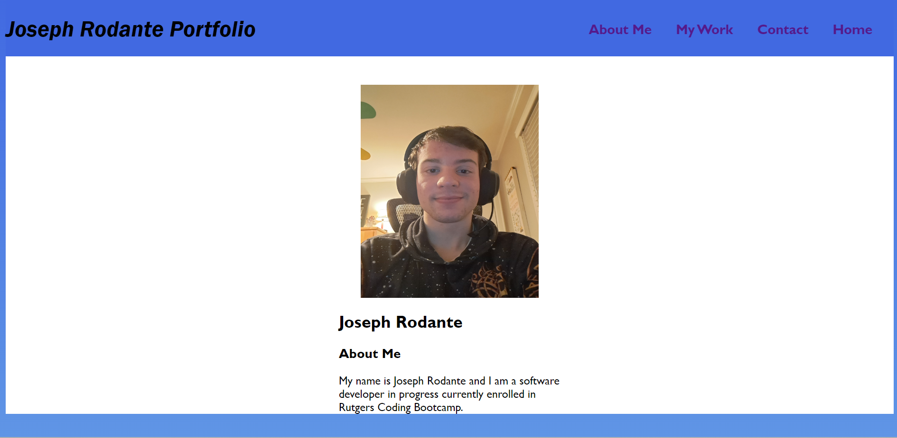

# First Portfolio

## Description

This project was created to be a portfolio for my future projects in coding. 
This allows me to have a place where all my projects are gathered together for an employer or anyone interested to see my work.
I learned more about HTML and CSS, mostly about how to space and align things properly. 

## Installation

N/A

[Portfolio Link Here](https://joeyrodo.github.io/Module-2-Challenge/)

## Usage

A user can click on the navigation options to take them to that specified area of the page. Users can also click on the application sections in the website, which for now are just placeholders, and be taken to where those respective applications would be. For now, since they do not hold any completed projects, they will just direct to this README file.

## Credits

This project was created by Joseph Rodante.

